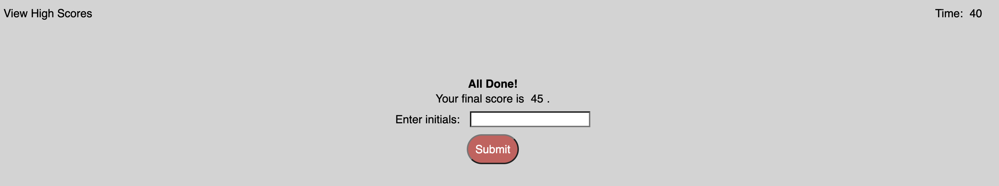

# Code Quiz

## Description

- This is the fourth challenge.
- The purpose of this repository is to create a timed quiz on JavaScript fundamentals that stores high scores.

## Usage

<a href="https://hbarry89.github.io/Code-Quiz/" target="_blank">Click here</a> to navigate to the live link of this repository.

- User is presented with a main page to start the quiz with a timer on the top right and high score link on the top left.

- User is presented with a series of questions to answer.

- User is directed to insert initials after the quiz is over.

## Credit

### Resources
- Bootcamp Materials
- W3 Schools
- Pseudo Code provided by TA in class
- Worked with Tutor, AskBCS Learning Assistants, and study groups.

### Assets
- Reset Code: Bootcamp Materials Unit 2 Activity 11.

### Applications Used
- VS Code

## Thank you for visiting!

